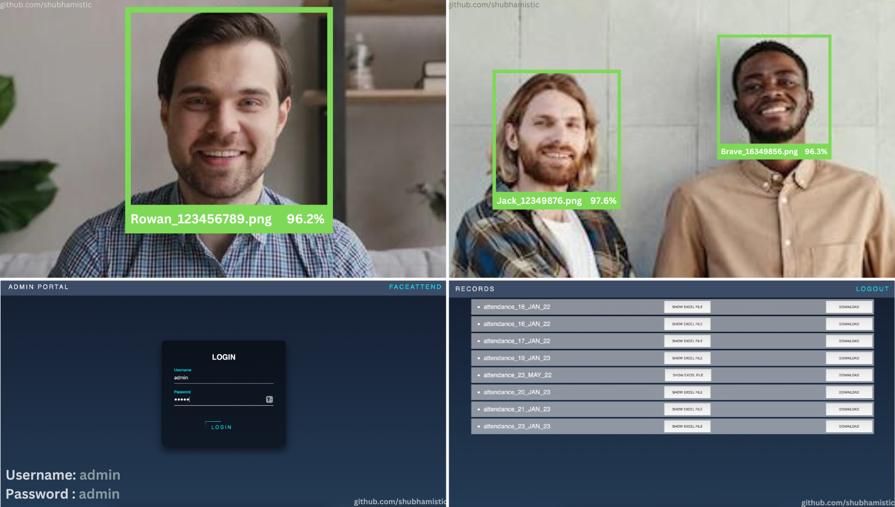

# FACE-ATTEND

Face Recognition Based Attendance System.

## Installation

Open the project folder using: 

```
$ cd FaceAttend-main
```

Install with pip:

```
$ pip install -r requirements.txt
```

Run the Face Recognition Module:

```
$ python3 face_detection/client.py
```

Run the Admin Page:

```
$ python3 admin_portal/run.py
```

### Related

Access admin page using:

```
Username: admin
Password: admin
```


## Demo




